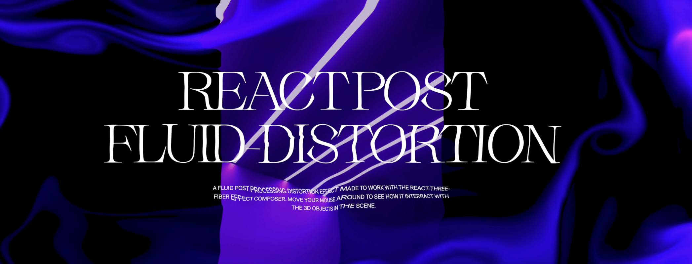

# Fluid Distortion for React Three Fiber



Modification of [Jérémie Nallet](https://github.com/whatisjery/react-fluid-distortion) to add a mask mode and lazy loading.

Implementing post-processing fluid distortion effects in response to cursor interactions for React-Three-Fiber.
Based on the shaders developed by [Pavel Dobryakov](https://github.com/PavelDoGreat/WebGL-Fluid-Simulation)

---

From the [react-three-fiber](https://github.com/pmndrs/react-three-fiber) documentation :

> [!WARNING]  
> Three-fiber is a React renderer, it must pair with a major version of React, just like react-dom, react-native, etc. @react-three/fiber@8 pairs with react@18, @react-three/fiber@9 pairs with react@19.

---

## Installation :

```bash
npm install fluid-maskeffect @react-three/drei @react-three/postprocessing postprocessing leva
```

> **Note:** The `Fluid` component has been removed. Only `FluidMask` is available in this package. If you were using `Fluid`, please migrate to `FluidMask` and adapt your code accordingly. maskMode is set to true by default,put false if you want to use it as a distortion effect set backgroundColor and fluidColor to a color without opacity.

## Example of use :

```jsx
import { FluidMask } from '@azam-fabien/fluid-dirstion-maskeffect';
import { EffectComposer } from '@react-three/postprocessing';
import { Canvas } from '@react-three/fiber';

<Canvas
    style={{
        position: 'fixed',
        top: 0,
        left: 0,
        height: '100vh',
        width: '100vw',
        background: '#000000',
    }}>
    <EffectComposer>
        <FluidMask />
        {/* ... other effects ... */}
    </EffectComposer>
</Canvas>;
```

## Display configuration panel :

Show a debug panel to test options more easily.

```jsx
const config = useConfig();

...

<FluidMask {...config} />
```

## Options :

| Name                   | Type        | Default Value            | Description                                                                                    |
| ---------------------- | ----------- | ------------------------ | ---------------------------------------------------------------------------------------------- |
| `fluidColor`           | hexadecimal | `rgba(255, 255, 255, 0)` | Sets the fluid color. Effective only when `rainbow` is set to `false`.                         |
| `backgroundColor`      | string      | `rgba(0, 0, 0, 0.86)`    | Sets the background color. Effective only when `showBackground` is `true`.                     |
| `showBackground`       | boolean     | `true`                   | Toggles the background color's visibility. If `false` it becomes transprent.                   |
| `blend`                | number      | `5`                      | Blends fluid into the scene when `showBackground` is true. Valid range: `0.00` to `10.0`.      |
| `intensity`            | number      | `40`                     | Sets the fluid intensity. Valid range: `0` to `10`.                                            |
| `force`                | number      | `0.4`                    | Multiplies the mouse velocity to increase fluid splatter. Valid range: `0.0` to `20`.          |
| `distortion`           | number      | `0`                      | Sets the distortion amount. Valid range: `0.00` to `2.00`.                                     |
| `radius`               | number      | `3`                      | Sets the fluid radius. Valid range: `0.01` to `1.00`.                                          |
| `curl`                 | number      | `10`                     | Sets the amount of the curl effect. Valid range: `0.0` to `50`.                                |
| `swirl`                | number      | `1`                      | Sets the amount of the swirling effect. Valid range: `0` to `20`.                              |
| `velocityDissipation`  | number      | `0.99`                   | Reduces the fluid velocity over time. Valid range: `0.00` to `1.00`.                           |
| `densitionDissipation` | number      | `0.96`                   | Reduces the fluid density over time. Valid range: `0.00` to `1.00`.                            |
| `pressure`             | number      | `0.84`                   | Controls the reduction of pressure. Valid range: `0.00` to `1.00`.                             |
| `rainbow`              | boolean     | `false`                  | Activates color mode based on mouse direction. No range applicable as this is a boolean value. |
| `maskMode`             | boolean     | `true`                   | Makes fluid act as a transparency mask when set to true                                        |
| `pointerEventsEnabled` | boolean     | `true`                   | false make so that you can click on button under the canvas ( pointer-events: none )           |

## Handling Loading State (onReady & loadingDelay)

The `FluidMask` component accepts two useful props for managing loading states:

-   **onReady**: a callback function called when the effect is fully initialized (i.e. textures, shaders, FBOs, etc. are ready).
-   **loadingDelay**: a minimum delay (in milliseconds) before `onReady` is called, even if everything is technically ready before.

This is useful if you want to display a loading screen or overlay until the effect is ready.

### Example: Show a black overlay while loading

```jsx
import { useState } from 'react';
import { FluidMask } from '@azam-fabien/fluid-dirstion-maskeffect';
import { EffectComposer } from '@react-three/postprocessing';
import { Canvas } from '@react-three/fiber';

export default function App() {
    const [isReady, setIsReady] = useState(false);

    return (
        <>
            {!isReady && (
                <div
                    style={{
                        position: 'fixed',
                        top: 0,
                        left: 0,
                        width: '100vw',
                        height: '100vh',
                        background: 'black',
                        zIndex: 9999,
                        display: 'flex',
                        justifyContent: 'center',
                        alignItems: 'center',
                        color: 'white',
                        fontSize: '2rem',
                    }}>
                    Loading...
                </div>
            )}
            <Canvas style={{ width: '100vw', height: '100vh' }}>
                <EffectComposer>
                    <FluidMask onReady={() => setIsReady(true)} loadingDelay={1000} />
                </EffectComposer>
            </Canvas>
        </>
    );
}
```

-   `onReady` will be called once everything is initialized and after the `loadingDelay` (if provided).
-   You can use this to hide a loading overlay, enable UI, etc.

## Using FluidMask for Transparent Fluid Effects

The `FluidMask` component creates a special effect where the fluid acts as a transparent "hole" in the background, revealing content underneath. This is particularly useful when you want to have a semi-transparent overlay with fluid-shaped cutouts.

```jsx
import { FluidMask } from '@azam-fabien/fluid-dirstion-maskeffect';
import { EffectComposer } from '@react-three/postprocessing';

// First, create your background HTML content
<div style={{
    position: 'fixed',
    top: 0,
    left: 0,
    width: '100%',
    height: '100%',
    zIndex: -1
}}>
    <h1>Content visible through the fluid</h1>
</div>

// Then use FluidMask in your Three.js setup
<Canvas style={{ position: 'fixed', top: 0, left: 0, width: '100%', height: '100%' }}>
    <EffectComposer>
        <FluidMask/>
    </EffectComposer>
</Canvas>
```

## Usage with nextjs

If you're working with an older version of Next.js, you may get this type of error:

```javascript
TypeError: Cannot read properties of undefined (reading '__SECRET_INTERNALS_DO_NOT_USE_OR_YOU_WILL_BE_FIRED')
```

To fix it, you can enable package transpilation in your next.config file. Here’s how:

```javascript
const nextConfig = {
    transpilePackages: ['@azam-fabien/fluid-dirstion-maskeffect'],
};

module.exports = nextConfig;
```
